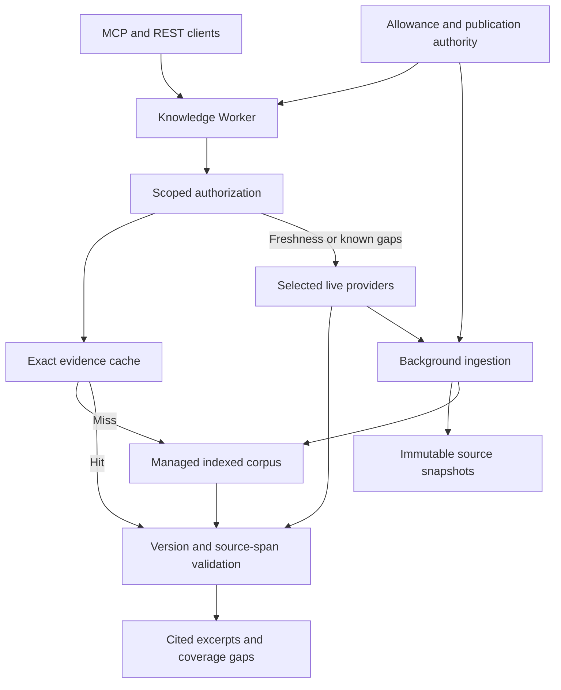

# Knowledge Gateway design

Status: product scope agreed; implementation and live validation remain pending.

## Purpose and scope

Add a personal technical-knowledge service beside MultiLLM's existing chat,
media and roleplay features. Coding tools and applications configure one gateway
URL and one scoped key. The service returns useful source excerpts, preserves
citations and version evidence, and reuses acquired material across questions.

The first delivery includes:

- Context7, Firecrawl, Exa, Mintlify Index and DeepWiki integrations.
- An indexed corpus seeded from active-project dependencies and their public
  upstream documentation, expanded from actual queries.
- Library usage and version-specific debugging as the primary acceptance cases.
- Explicit REST and remote MCP retrieval.
- Source coverage, freshness, indexing jobs, allowance usage and an evidence
  query tester in the existing MultiLLM dashboard.
- Capped background indexing and refresh with an interactive allowance reserve.

Private repository ingestion, uploaded private documents, public customer
tenancy and automatic retrieval inside ordinary chat are outside this scope.
Supporting a provider does not mean calling it on every query.

## Caller contract

The primary endpoint and MCP tool share one domain operation:

```text
POST /v1/knowledge/context
MCP: knowledge_context
```

```json
{
  "query": "How does Flask 3.1.3 enforce request size limits?",
  "product": "flask",
  "version": "3.1.3",
  "repository": "pallets/flask",
  "mode": "smart",
  "token_budget": 6000,
  "freshness": "normal"
}
```

The version is the caller's target, not a claim that matching documentation
exists. Clients should obtain resolved dependency versions from local lockfiles.
Dependency registration sends the minimum public package/version metadata;
private source files, local paths and credentials do not become corpus inputs.

The response contains:

- Ranked source excerpts with original URLs, immutable artifact references and
  citation locators.
- Requested version, observed version and the basis for any compatibility claim.
- Separate related evidence when an exact requested version cannot be verified.
- Explicit coverage gaps and partial-result reasons.
- Last successful source check, artifact retrieval time, index publication time
  and refresh status.
- Providers used, cache/index/live retrieval path, elapsed time and usage receipts.
- Token-counting method; counts are estimates unless the selected tokenizer can
  enforce the caller's exact budget.

Use `POST /v1/knowledge/search` for normalized search results and diagnostics.
Index administration has separate authenticated routes and permissions. Clients
do not acquire a second public credential or coordinate indexing stages.

`economy` uses the corpus and at most one selected live provider at a time.
`smart` uses the corpus and normally one or two complementary live providers
when needed. `deep` admits all relevant configured providers within its deadline
and allowance. A deep request can still return partial evidence.

Invalid input returns 400; authentication and scope failures return 401/403.
Admission refusal returns a structured limit/budget error. Complete upstream
failure remains a service error. A successful search with no matching evidence
returns an explicit `insufficient_evidence` result, distinct from service failure.
Do not cache provider failures as successful evidence.

## Existing integration constraints

The current Worker dispatches selected provider routes directly, sends roleplay
to Durable Objects, and forwards other routes to the Flask Container named
`primary`. Its direct token checks do not share Flask's persisted user/key
authorization automatically.

Flask's `api_authenticate_only(required_scope=...)` is a suitable authentication
seam. Its normal provider decorator also reserves LLM requests/tokens and is not
the Knowledge admission policy. Regular users currently receive fixed
`chat,models` scopes; knowledge-only provisioning requires an explicit extension.

NanoGPT already exposes native web search, and Gemini supports search grounding.
These routes remain available. They do not currently supply the new normalized
evidence contract, persistent corpus or cross-provider ranking.

The existing generic cache, metrics and circuit state do not constitute a durable
evidence store or spend ledger. The current control-plane PostgreSQL adapter is
also too narrowly scoped to treat as a general knowledge database.

## Deployment and ownership

Use a dedicated Knowledge Worker behind the existing MultiLLM hostname, reached
through an explicit route/service binding. Run ingestion independently of both
the retrieval Worker and the existing chat Container.



Proposed Cloudflare responsibilities:

| Component | Responsibility |
| --- | --- |
| Workers | REST/MCP transport, retrieval orchestration and separately deployed ingestion |
| AI Search | Managed keyword/vector retrieval and indexing; use raw search results |
| R2 | Immutable permitted source content and normalized citation snapshots |
| Durable catalogue | Source policies, artifact manifests, versions and job receipts |
| Durable Objects | Atomic allowance reservations, publication fencing and duplicate-work coordination |
| Background executor | Durable ingestion steps, readiness checks and reconciliation |
| Workers Cache | Authenticated internal evidence caching with explicit versioned keys |

Start with a Workflow-based ingestion executor because a job spans acquisition,
normalization, upload, indexing acknowledgement and publication. Add a Queue only
if measured burst buffering or admission needs justify another execution layer.
The catalogue can use the same SQLite-backed Durable Object authority for the
initial personal deployment, with separate cohesive corpus and allowance modules.
Avoid duplicating authoritative publication pointers across D1 and Durable Objects.
Add a separate catalogue database only when query volume or reporting requires it.

Keep document bodies outside the coordinating object. Transactions protect short
state transitions; provider calls and indexing waits run outside transactions.

## Retrieval and evidence ownership

AI Search is the preferred initial corpus engine because it already provides
hybrid keyword/vector retrieval, metadata filtering and optional reranking.
Its result score is a relevance signal, not proof that a fact or version is true.
MultiLLM owns the evidence contract outside the managed index.

The conceptual domain shapes are:

```typescript
type VersionEvidence =
  | { kind: "exact"; version: string; proofUrl: string }
  | { kind: "documented_range"; range: string; proofUrl: string }
  | { kind: "unknown" };

type ArtifactRevision = {
  id: string;
  canonicalUrl: string;
  contentHash: string;
  version: VersionEvidence;
  fetchedAt: string;
};

type SourceObservation =
  | { kind: "source_excerpt"; artifact: ArtifactRevision; text: string }
  | { kind: "derived_context"; text: string; sourceUrls: string[] }
  | { kind: "discovery"; sourceUrls: string[] };

type CitedExcerpt = {
  artifactId: string;
  text: string;
  locator: { heading?: string; startByte: number; endByte: number };
  targetMatch: "exact" | "documented_range" | "unverified";
};

interface Knowledge {
  context(principal: ReadPrincipal, request: ContextRequest): Promise<EvidenceBundle>;
  search(principal: ReadPrincipal, request: SearchRequest): Promise<SearchResults>;
}

interface RetrievalSource {
  retrieve(intent: RetrievalIntent, permit: OperationPermit): Promise<SourceBatch>;
}

interface Corpus {
  search(target: ResolvedTarget, request: SearchRequest): Promise<CorpusCandidates>;
  schedule(principal: ManagePrincipal, source: ApprovedSource): Promise<JobReceipt>;
}

interface Allowances {
  reserve(operation: OperationId, bound: ChargeBound): Promise<OperationPermit>;
  settle(permit: OperationPermit, outcome: ChargeOutcome): Promise<UsageReceipt>;
}
```

These are interface sketches, not new runtime dependencies or implemented types.
Boundary validation constructs domain values; provider wire formats stay inside
adapters. Byte locators refer to the normalized UTF-8 snapshot. Every served
excerpt requires a validated immutable snapshot and a
matching source span. Candidates from the index additionally require published,
searchable state. A validated live excerpt can be returned with indexing pending;
its response must not wait for embedding or index publication.

The retrieval path:

1. Authorize the request and capture its allowed corpus and policy generation.
2. Resolve product/version context and check the exact evidence cache.
3. On a miss, search indexed text and semantic content together.
4. For explicit freshness or known coverage gaps, admit complementary live
   retrieval in parallel. Ordinary queries assess corpus coverage first.
5. Validate source identity and version evidence before ranking. Unknown or
   incompatible versions cannot silently satisfy an exact-version request.
6. Match returned text to a stored normalized source span. Retain the extraction
   mapping needed to locate that span in the original artifact.
7. Deduplicate by canonical artifact and revision. Preserve version-significant
   URL paths and parameters; cosmetic URL normalization must not merge releases.
8. Rank for the actual question and pack intact, useful excerpts into the budget.
9. Return gaps and timestamps; enqueue eligible new artifacts independently.

Two providers returning the same document are two retrieval observations of one
source. They do not establish independent corroboration. Authority is contextual:
an issue report, fix commit and released documentation answer different questions.
A merged pull request does not prove that a fix shipped in the requested release.

Provider-generated explanations are discovery or derived context. They cannot
be quoted as primary source text. Their links can lead to qualifying source
artifacts; unsupported explanations never acquire a fabricated version label.

## All five provider adapters

| Provider | Intended contribution | Required boundary |
| --- | --- | --- |
| Context7 | Library discovery and documentation retrieval | Record resolved library identity and actual version coverage; never assume every patch exists |
| Firecrawl | Documentation, issues, merged PRs, READMEs and acquisition where supported | Preserve artifact kind and matched passages; distinguish reports, fixes and released behavior |
| Exa | Complementary technical discovery and source acquisition | Normalize source evidence and operation-level usage; exclude unsupported generated text from excerpts |
| Mintlify Index | Cited technical context and documentation discovery | Treat assembled answers as derived context; qualify their underlying sources |
| DeepWiki | Repository context and source discovery supporting debugging | Do not infer branch/tag/commit binding from a repository-only question |

All five belong in the first delivery, including capability/status reporting,
adapter tests and representative live validation. A provider may be ineligible
for a particular request because of version coverage, relevance, allowance,
availability or retention policy. Ineligibility must be explainable.

Current upstream API shapes, allowance probes and permitted retention must be
verified per provider during implementation. Configure prices and billing units
from verified provider contracts. Existing NanoGPT search and Gemini
grounding can be evaluated later without changing their current routes.

## Index once per revision

Seed public upstream sources from active-project dependency profiles. For this
repository, the current lockfiles provide Flask 3.1.3, Werkzeug 3.1.8, Requests
2.33.1 and psycopg 3.3.5; Cloudflare platform documentation is also relevant.
These are seed candidates, not claims of already indexed version coverage.

Track source identity, immutable validated content revision, derived index
representation, and the mutable pointer to the currently published index revision.
Snapshot validation and index readiness are separate states: a live response can
cite a validated snapshot before that revision joins the searchable corpus.
The projection identity includes content, extractor/chunker configuration and
embedding/index configuration. Identical content is not reprocessed unless its
required representation changes.

An ingestion job:

1. Checks source policy, public destination, size limits and its budget permit.
2. Fetches conditionally using source validators where available.
3. Skips processing only when both content and the desired projection identity
   match. A 304 updates the source-check timestamp but can still require a new
   projection built from the stored snapshot after configuration changes.
4. Persists immutable source and normalized citation snapshots.
5. Uploads permitted normalized material under immutable revision keys.
6. Waits for indexed/searchable acknowledgement outside the query path.
7. Verifies expected retrieval and source-span correspondence.
8. Publishes the ready revision using the source's current fencing token.

Built-in AI Search item ingestion avoids using scheduled R2 synchronization as
the immediate acquisition-to-search path. R2 retains provenance separately.
Oversized inputs require source-preserving partitions within documented limits.

A late older job cannot move a current pointer backward. Duplicate jobs reuse
durable receipts. An ambiguous upload timeout remains pending until status can
be reconciled; it does not trigger an unqualified repeat charge.

Queries validate ready manifests and recheck generation before caching.
A publication race causes one bounded retry or an explicit uncached partial
result. Pending, tombstoned and superseded-current artifacts do not leak through
stale index candidates; explicitly requested historical releases remain usable.

Refresh moving documentation and active issues according to configurable source
policies. Explicit freshness requests require a sufficiently recent successful
check or a visible freshness gap. Cache hits retain original evidence timestamps.
Retention is bounded by provider policy and configured storage limits. Pin active
dependency versions; evict eligible unpinned material when necessary and mark
expired citation content unavailable rather than inventing reproducibility.

## Authorization and operations

Provision dedicated `knowledge:read` and `knowledge:manage` permissions through
MultiLLM's existing key-management surface. Read access does not grant source
administration or general chat privileges. Upstream credentials stay server-side
in the intended runtime's secret bindings.

Initially, a private auth-only integration can reuse Flask's persisted key checks
without LLM quota reservations. Validate service identity separately from the
caller's key and derive principals server-side. Treat cold Container authentication
as part of end-to-end latency, not as an excluded benchmark cost.

The outer authorization gate always executes before serving cached evidence.
Positive authorization caching is off by default. If needed for performance,
it requires a specified revocation/expiry contract; internal grants remain hidden
from MCP/REST clients. If the existing auth dependency prevents acceptable
performance, establish an authoritative edge verifier before release rather than
silently weakening revocation.

The dashboard extends existing navigation and styling with:

- Provider eligibility, capability and credential status without secret values.
- Seed sources, package/version coverage and missing documentation.
- Last source check, revision publication and pending refresh state.
- Index jobs with bounded progress, retry reason and cancellation state.
- Confirmed, estimated and unknown usage plus interactive/background allocations.
- A query tester showing excerpts, version basis, source links, provider selection,
  cache/index/live path and elapsed time.

Cancellation prevents future work; it cannot promise reversal of an accepted
upstream operation. Admin actions and budget changes require manage permission.
Provider limits or failures remain visible rather than appearing as empty success.

## Allowances and background admission

Every potentially billable operation requires a conservative charge bound before
dispatch. The durable ledger includes confirmed usage, pending reservations and
unknown outcomes, identified by provider account, allowance window and operation.
Duplicate requests reuse the same reservation. Timeouts, lease expiry and client
cancellation do not establish that a charge was avoided.

Background work must satisfy both its own cap and the interactive reserve.
Interactive traffic takes priority; background work pauses before consuming that
reserve. Configure per-provider allocations and storage limits in the dashboard.
An unset allocation authorizes zero speculative background expenditure.

Use quota pressure only to choose among relevant, affordable sources. Expiring
credits cannot override version correctness or source suitability.

Gateway reservations alone cannot guarantee an account-wide invoice cap when
other clients spend from the same account, storage charges accrue, or managed
operations have unbounded internal work. Before enabling billable integration,
verify the allowance boundary, operation bounds and applicable hard-stop controls.
Unknown exposure fails closed; use qualifying existing evidence when available.

Include query embeddings, ingestion, optional rewriting/reranking, storage and
separate model-service charges. AI Search's current beta status does not make all
related services free. This is an implementation acceptance gate for managed
and custom retrieval alike.

## Performance validation

Use three paths: exact evidence-cache hits, indexed retrieval for new questions,
and live retrieval for missing or freshness-sensitive evidence.

Workers Cache belongs on an internal evidence entrypoint. Cache identity includes
normalized request, requested version, corpus generation, policy version and
authorized scope. Never treat approximate semantic similarity as an exact cache
hit. Coalesce identical in-flight work and bound independent provider concurrency.

Cache entries expire within the strictest source-retention and requested-freshness
window. Live excerpts use bounded TTLs even before index publication. Partial and
insufficient-evidence results are uncached by default; any enabled negative cache
has a separately short TTL. Revalidate current source eligibility and tombstones
before serving a hit. Distinguish providers that contributed stored evidence from
providers called on this request, and report this request's timing and usage
instead of replaying the original request's charges.

Avoid a mandatory answer-generation or reranking model on every request. Run
independent retrieval branches in parallel under shared admission/deadline control.
Indexing, corpus-wide crawling and readiness polling stay off the request path.
A bounded source fetch and snapshot validation can be necessary for a live excerpt;
account for that work in live-retrieval latency and admission.

Build a pinned public fixture set covering library usage, exact version changes,
error strings, issue/fix/release relationships, duplicate sources, unsupported
versions and misleading derived answers. Include a representative case for every
provider even though library usage and debugging lead the product.

Run reproducible comparisons:

| Dimension | Cases |
| --- | --- |
| Authorization | Cold and warm, including existing chat load |
| Retrieval | Exact cache, indexed miss, targeted federation, deep mode |
| Concurrency | One, five and twenty simultaneous requests |
| Ingestion | Idle and active refresh overlapping foreground queries |
| Failures | Timeouts, duplicate delivery, ambiguous charge, stale candidates and publication races |
| Baselines | Strongest relevant single provider, corpus-only and corpus-plus-live retrieval |

Record p50/p95/p99 latency, citation-span integrity, version contamination,
retrieval usefulness, upstream calls, allowance units and publication lag.
Run the full fixture matrix offline first; cap live benchmark work within an
explicit configured allowance.

Choose default deadlines, source concurrency and any optional reranking from
these measurements. A deadline limits waiting; it does not impose a fixed delay.
No latency target is established as measured performance. Cache-hit speed cannot stand in for
indexed-search performance, and dropping hard questions cannot count as a win.
Release requires no silent version substitution or invalid citation spans in the
acceptance set, plus evidence-quality and latency results against the baseline.

## Module boundaries

| Proposed area | Ownership |
| --- | --- |
| `worker/knowledge/api/` | REST/MCP transport, schema validation and authorization integration |
| `worker/knowledge/retrieval/` | Request planning, bounded parallel work and coverage decisions |
| `worker/knowledge/evidence/` | Artifact identity, version qualification, source spans, ranking and packing |
| `worker/knowledge/corpus/` | Snapshot persistence, publication state, freshness and managed-index adapter |
| `worker/knowledge/providers/` | The five upstream adapter contracts and normalized observations |
| `worker/knowledge/allowances/` | Durable operation reservations and account-window reconciliation |
| `routes/knowledge_admin.py` and associated service | Existing dashboard/admin integration |
| `templates/knowledge.html` and associated static modules | Operator views and query inspection |
| Dedicated Knowledge Wrangler configuration | Separate execution/resources and service bindings |
| Knowledge fixtures and focused Worker/Python tests | Evidence, adapter, race, authorization and accounting checks |

Use cohesive modules following existing Python/JavaScript conventions. Public
contracts hide provider and storage wire formats. Keep additions to the large
existing ingress/auth files minimal and extract a relevant boundary where safe.

## Design choice and implementation sequence

Choose managed AI Search as the initial corpus engine. A custom R2/lexical/
Vectorize stack would add chunking, embedding, index repair and retrieval
maintenance without a demonstrated quality or latency advantage. Preserve
immutable provenance and publication fencing outside either engine.

Use a custom retrieval implementation only if representative tests show that
managed source-span integrity, metadata/version filtering, readiness or bounded
spending cannot satisfy the contract. Do not build two production stacks.

Deliver in independently verifiable increments:

1. Establish allowance feasibility and frozen evidence/adapter fixtures.
2. Add knowledge scopes, transport contracts and dashboard integration boundaries.
3. Prove one-source revision ingestion, searchable readiness and cited retrieval.
4. Complete all five adapters with explicit capability and usage reporting.
5. Add policy-based federation, bounded caching and incremental source profiles.
6. Finish operator views and exercise the reproducible quality/performance matrix.
7. Validate the deployed MCP and REST journeys and existing-feature regressions.

The first delivery requires all five provider integrations. Documentation or
mocked tests alone do not complete a provider integration.
Deployment remains a separate operation after implementation and verification.

## Verification basis

Repository request paths, scope handling, existing search routes and storage
boundaries were inspected. Two architecture shapes were compared; the chosen
shape preserves a simple caller contract and uses managed retrieval while retaining
explicit evidence and budget ownership. No runtime performance is asserted.

Current Cloudflare documentation supports the platform choices:

- [AI Search overview](https://developers.cloudflare.com/ai-search/)
- [Managed AI Search versus Vectorize](https://developers.cloudflare.com/ai-search/concepts/how-ai-search-works/)
- [Hybrid search](https://developers.cloudflare.com/changelog/post/2026-04-16-hybrid-search-and-relevance-boosting/)
- [Metadata filtering](https://developers.cloudflare.com/ai-search/configuration/retrieval/filtering/)
- [Source chunks and citations](https://developers.cloudflare.com/ai-search/how-to/chunk-citations/)
- [Item ingestion and searchable readiness](https://developers.cloudflare.com/ai-search/how-to/fetch-and-index-web-pages/)
- [Syncing](https://developers.cloudflare.com/ai-search/configuration/indexing/syncing/)
- [Limits and separately billed services](https://developers.cloudflare.com/ai-search/platform/limits-pricing/)
- [Workers Cache configuration](https://developers.cloudflare.com/workers/cache/configuration/)
- [Durable Object storage and transactions](https://developers.cloudflare.com/durable-objects/best-practices/rules-of-durable-objects/)

Upstream provider contracts, source retention rules, account-specific allowances
and live latency still require implementation-stage verification.
